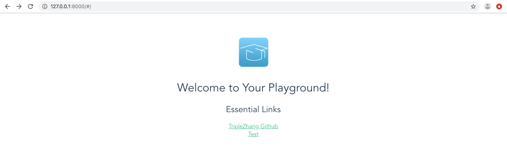

## CompilerBuddy 编译器判断正误模块

CompilerBuddy编译器判断正误模块，向web应用提供判断接口，该接口接收目标路径字符串，返回判断结果。

**注：由于无法部署本项目，模块的开发和测试过程均在Vue+Django架构下进行。前后端开发者，需要根据实际情况进行使用。**

### 模块构成

判断正误模块由以下4部分构成：

- `_init_.py`
- `code`：文件夹中存放编译器完整代码（由于版权问题，当前版本为一个小的demo），目前使用code文件夹模拟用户的开发路径。
- `judge.py`：判断正误模块实现，接收路径信息，返回执行结果。
- `make.sh`：shell文件在code路径下执行make命令，编译用户代码。
- `runtiger.sh`：shell文件执行code路径下的可执行文件。

### 模块使用

1. `judge.py`使用方法

后端代码应向该模块传入目标用户的文件路径字符串，如果判断正确则返回1，如果判断错误则返回0。在Vue+Django的架构下，需要在Django应用的`views.py`文件中引入该模块：

```Python
from tiger.judge import judge
```

同时，在文件中定义方法，使用judge方法，给json串相应字段赋值：

```python
def test(request):
    return JsonResponse({"status" : 0, "message" : judge("XXX")})
```

此外，在项目根目录下的`urls.py`中，增加对`test`的访问路径：

```python
from backend.views import test
...
urlpatterns = [
    ...
    path("test/", test),
    ...
]
```

在前端部分，取该路径返回的json串即可。

2. `make.sh`使用方法

目前版本，**需要将`make.sh`文件放在项目根路径下**，以便模块使用。shell文件接收用户文件路径，在指定路径下对用户项目进行编译。

3. `runtiger`使用方法

目前版本，**需要将`runtiger.sh`文件放在项目根路径下**，以便模块使用。shell文件接收用户文件路径，执行该路径下可执行文件。

4. `code`使用方法

由于版权问题，目前使用的是一个小的demo。在未来的版本中，该路径应存放完整的编译器代码。

### 模块测试

因为无法部署该项目，测试部分在Vue+Django的架构下完成。

1. 在浏览器输入你服务器的 ip（这里我们输入本机 IP 地址： **127.0.0.1:8000**） 及端口号，如果正常启动，输出结果如下：

   

2. 点击Test链接，进入测试页，测试页显示编译执行结果

   

### 未完成部分

1. `judge.py`模块目前仅为一个简单的接口测试版本，未来将逐步实现应有功能。
2. `code`部分的版权问题还需考虑。目前看来，结课版本可能只能使用demo版本代码。
3. 指导文档还需进行编写。