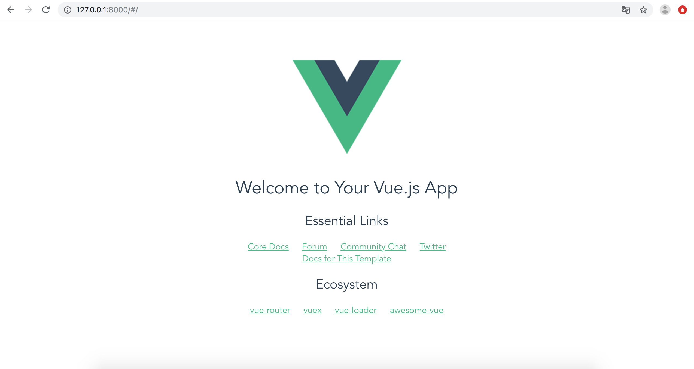

# Compiler_teaching_platform
本项目采用Vue.js + Django做为框架进行开发。

参考学习的教程（可以在下方进行补充）：

- [如何使用 Django + Vue.js 快速构建项目](https://zhuanlan.zhihu.com/p/25080236)

项目所需环境配置

- Django [安装](https://www.runoob.com/django/django-install.html)
- Vue.js（[macOS配置](https://blog.csdn.net/ytangdigl/article/details/75095787), [其他系统配置参见官网](https://cli.vuejs.org/zh/)）

### 项目中各文件目录作用

最顶层文件夹下有如下文件：

- Compiler_teaching_platform
- manage.py

#### 1. Compiler_teaching_platform

该文件夹是执行`django-admin startproject Compiler_teaching_platform`时创建的，其中包括：

（1）`_init_.py`

（2）`settings.py`: 这个文件中包括了项目的初始化设置，可以针对整个项目进行有关参数配置，比如配置数据库、添加应用等。

（3）`urls.py`：这是一个URL配置表文件，主要是将URL映射到应用程序上。当用户请求某个URL时，Django会根据这个文件夹中的映射关系指向某个目标对象，该对象可以是某个应用中的urls.py文件，也可以是某个具体的视图函数。在Django中，这个文件也被称为URLconf，这是Django非常强大的一个特性。

（4）`wsgi.py`: WSGI是 Web Server Gateway Interface缩写，它是python所选择的服务器和应用标准，django也会使用。wsgi.py定义了我们所创建的项目都是WSGI应用。

#### 2. manage.py

该文件是执行`django-admin startproject Compiler_teaching_platform`时创建的，它是django的任务管理命令行工具。

### Django + Vue.js 构建项目

在新建好的Django project中，分别创建前端和后端。

#### 1. 创建一个 app 作为项目后端

（1）在项目根目录下，执行startapp指令，为项目新建一个Django app作为后端。

```
$ python manage.py startapp backend
```

（2）指令执行后，生成一个名为backend的app，其中包括：

- `_init_.py`
- `admin.py` :
- `apps.py` :
- `models.py` :
- `tests.py` :
- `views.py` :

#### 2. 使用vue-cli创建一个vuejs项目作为项目前端

（1）在项目根目录下，执行vue-init webpack指令，为项目新建一个Vue.js项目作为前端。

```
$ vue-init webpack frontend
```

（2）执行指令后，生成一个名为frontend的Vue.js的项目。

#### 3. 使用webpack打包Vue.js项目

本质上，[webpack](https://www.webpackjs.com/concepts/) 是一个现代 JavaScript 应用程序的静态模块打包器(module bundler)。当 webpack 处理应用程序时，它会递归地构建一个依赖关系图(dependency graph)，其中包含应用程序需要的每个模块，然后将所有这些模块打包成一个或多个 bundle。

（1）进入frontend路径，运行npm指令

```
$ cd frontend
$ npm install
$ npm run build
```

（2）执行后，frontend路径中增加了一个dist文件夹。

#### 4. 使用Django的通用视图 TemplateView

在项目根目录的`urls.py`中，使用通用视图创建最简单的模板控制器，使得访问“／”路径时，返回`index.html`

```
from django.contrib import admin
from django.urls import path
from django.conf.urls import url
from django.views.generic.base import TemplateView

urlpatterns = [
    path('admin/', admin.site.urls),
    url(r'^$', TemplateView.as_view(template_name="index.html")),
]
```

#### 5. 配置Django项目的模板搜索路径

配置Django项目的模板搜索路径，使Django知道从哪里找到`index.html`

打开Django app项目根目录下`settings.py`，找到TEMPLATES配置项，将`dist`路径填入‘DIRS’项中：

```
TEMPLATES = [
    {
        'BACKEND': 'django.template.backends.django.DjangoTemplates',
        'DIRS': ['frontend/dist'],
        'APP_DIRS': True,
        'OPTIONS': {
            'context_processors': [
                'django.template.context_processors.debug',
                'django.template.context_processors.request',
                'django.contrib.auth.context_processors.auth',
                'django.contrib.messages.context_processors.messages',
            ],
        },
    },
]
```

#### 6. 配置静态文件搜索路径

将Vue.js的页面映射到`index.html`，在Django app项目根目录下`settings.py`中，增加‘STATICFILES_DIRS’配置项：

```
# Add for vuejs
STATICFILES_DIRS = [
    os.path.join(BASE_DIR, "frontend/dist/static"),
]
```

### 运行项目

1. 在项目文件夹下运行指令启动服务器：

```
$ cd yourdir/Compiler_teaching_platform
$ python3 manage.py runserver 0.0.0.0:8000
```

2. 在浏览器输入你服务器的 ip（这里我们输入本机 IP 地址： **127.0.0.1:8000**） 及端口号，如果正常启动，输出结果如下：

   

