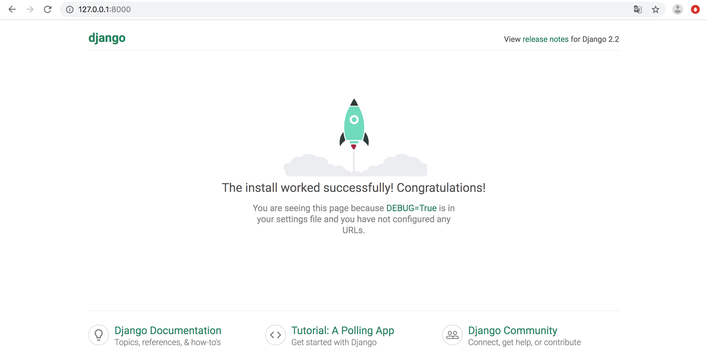

# Compiler_teaching_platform
本项目采用Vue.js + Django做为框架进行开发。

参考学习的教程（可以在下方进行补充）：

- [如何使用 Django + Vue.js 快速构建项目](https://zhuanlan.zhihu.com/p/25080236)

项目所需环境配置

- Django [安装](https://www.runoob.com/django/django-install.html)
- Vue.js（[macOS配置](https://blog.csdn.net/ytangdigl/article/details/75095787), [其他系统配置参见官网](https://cli.vuejs.org/zh/)）

### 项目中各文件目录作用

最顶层文件夹下有如下文件：

- Compiler_teaching_platform
- manage.py

#### 1. Compiler_teaching_platform

该文件夹是执行`django-admin startproject Compiler_teaching_platform`时创建的，其中包括：

（1）`_init_.py`

（2）`settings.py`: 这个文件中包括了项目的初始化设置，可以针对整个项目进行有关参数配置，比如配置数据库、添加应用等。

（3）`urls.py`：这是一个URL配置表文件，主要是将URL映射到应用程序上。当用户请求某个URL时，django会根据这个文件夹中的映射关系指向某个目标对象，该对象可以是某个应用中的urls.py文件，也可以是某个具体的视图函数。在django中，这个文件也被称为URLconf，这是django非常强大的一个特性。

（4）`wsgi.py`: WSGI是 Web Server Gateway Interface缩写，它是python所选择的服务器和应用标准，django也会使用。wsgi.py定义了我们所创建的项目都是WSGI应用。

#### 2. manage.py

该文件是执行`django-admin startproject Compiler_teaching_platform`时创建的，它是django的任务管理命令行工具。

### 运行项目

1. 在项目文件夹下运行指令启动服务器：

```
$ cd yourdir/Compiler_teaching_platform
$ python3 manage.py runserver 0.0.0.0:8000
```

2. 在浏览器输入你服务器的 ip（这里我们输入本机 IP 地址： **127.0.0.1:8000**） 及端口号，如果正常启动，输出结果如下：

   

